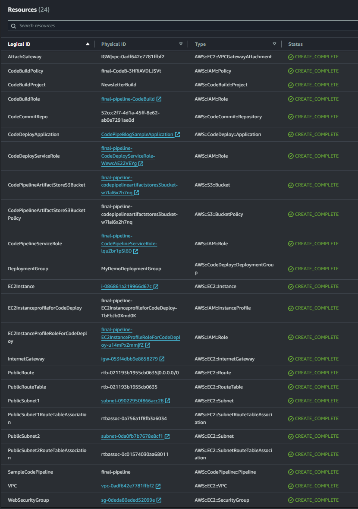
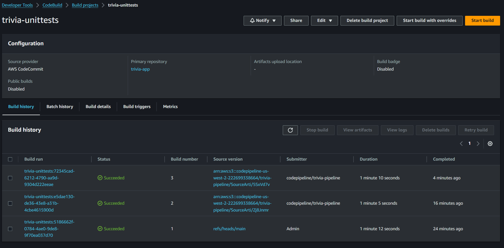
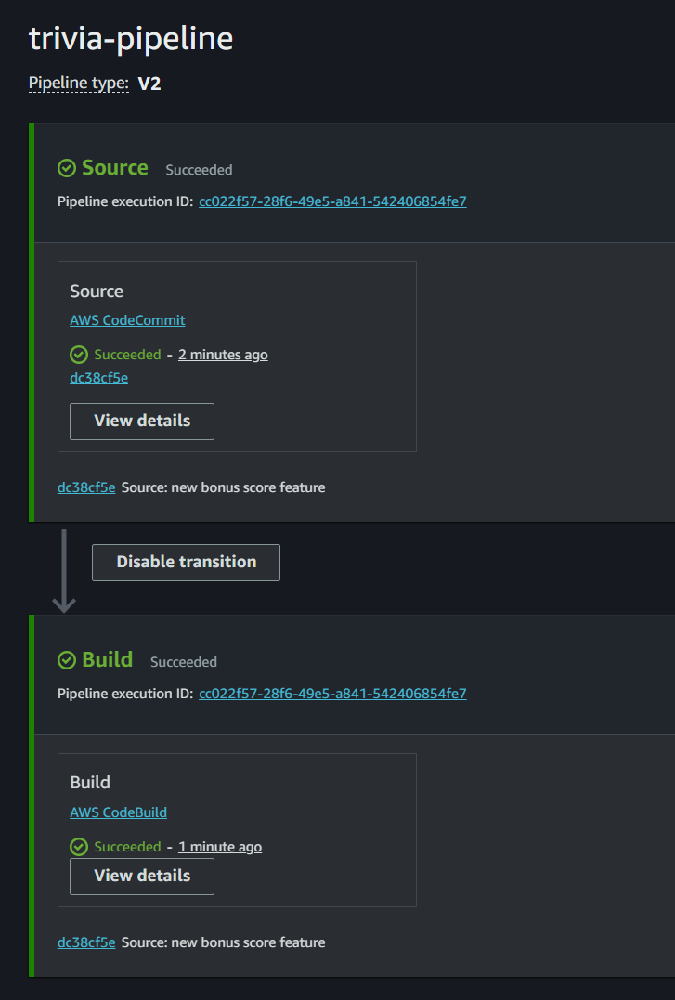
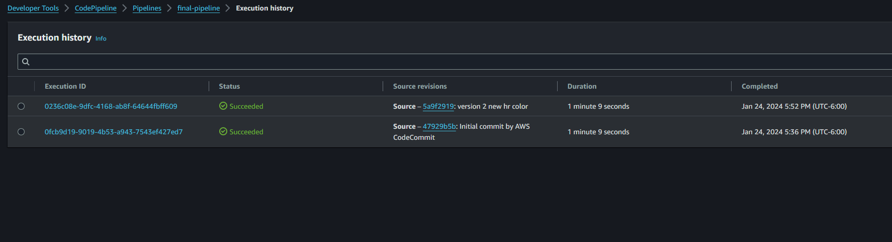

# Triva Game Backend with AWS
This repository showcases a four-phase project exploring the realm of serverless architectures on AWS. 
I pulled alot of lessons learned from this [AWS DevOps](https://www.coursera.org/account/accomplishments/specialization/GC49T2KNZDS9) course in order to complete this project.
Through this exploration, a functional application was deployed, utilizing various AWS services and best practices.

### The Phases:

Phase 1: Building the Foundation: This phase lays the groundwork by setting up the development environment using AWS Cloud9. CloudFormation templates are utilized to provision essential resources like S3 buckets, API Gateways, and Lambda functions. A basic frontend on Node.js is used to interact with the backend.

Phase 2: Testing and Refactoring: Unit and integration tests are implemented to ensure code quality and functionality. Potential bugs are identified and addressed, leading to code refactoring for improved performance and maintainability.

Phase 3: Continuous Integration with CodeBuild: To automate testing and deployment, a CodeBuild pipeline is established. This pipeline automatically builds, tests, and generates reports for every code change, streamlining the development process.

Phase 4: Automation and Optimization with CodePipeline: A robust CodePipeline is then implemented to fully automate the build, test, and deployment stages. This pipeline integrates seamlessly with CodeBuild, enabling continuous delivery and ensuring the application is always up-to-date with the latest code changes.

### Key Technologies:

- AWS Cloud9 for development environment
- AWS CloudFormation for infrastructure provisioning
- AWS S3 for static content hosting
- AWS API Gateway for API management
- AWS Lambda for serverless functions
- AWS CodeBuild for continuous integration
- AWS CodePipeline for continuous delivery

### Benefits and Takeaways:

- Hands-on experience with core AWS services: Gained practical knowledge of building and deploying serverless applications on AWS.
- Automated build and deployment pipelines: Enhanced development efficiency and reliability through automation.
- Established focus on core development: Allocate more time to coding by automating repetitive tasks.
- Devoloped scalable and secure infrastructure: Leveraged the benefits of serverless architecture for cost-effective and secure deployments.

This project served as a stepping stone for me as I further explore the exciting world of DevOps.

- LinkedIn: [Noah Heath](https://www.linkedin.com/in/neheath/)
- View [My Cloud Resume](https://resume.ne-heath.com/)
